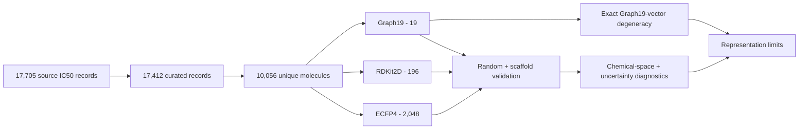

# EGFR Graph QSAR Reproducibility

**Reproducibility repository for**  
**Representation Degeneracy and Generalization Limits of Classical Molecular Graph Descriptors in EGFR QSAR**

[](LICENSE)
[](DATA_LICENSE_NOTICE.md)
[](#release-status)

## Why this study?

This study treats **19 classical mathematical molecular-graph invariants (Graph19)** as an intentionally compressed representation rather than as an accuracy-optimized replacement for modern cheminformatics features. The central question is:

> **What EGFR pIC50 predictive signal survives compression to 19 classical graph invariants, and where does that compression fail?**

The same frozen 10,056-compound EGFR cohort is evaluated with Graph19, 196 RDKit2D descriptors and 2,048-bit ECFP4 fingerprints under matched Random Forest principles, random splits, Bemis-Murcko scaffold folds, chemical-space diagnostics and uncertainty analysis.



## Key results

| Result | Graph19 | RDKit2D | ECFP4 |
|---|---:|---:|---:|
| Features | 19 | 196 | 2,048 |
| Random-split mean R2 | 0.392 | 0.657 | **0.735** |
| Scaffold mean R2 | 0.211 | 0.518 | **0.615** |
| Random RMSE | 1.068 | 0.802 | **0.705** |
| Scaffold RMSE | 1.197 | 0.933 | **0.837** |

Matched ECFP4 gains over Graph19 were **+0.343 R2** (95% CI 0.309-0.377) under random splitting and **+0.404 R2** (0.310-0.498) under scaffold splitting; the direction was positive in all five matched partitions.

### Exact representation degeneracy

- 10,056 molecules collapse to **7,382 distinct Graph19 vectors**.
- **1,507 exact Graph19 descriptor-vector collision groups** contain **4,181 molecules (41.6%)**.
- **1,285 (85.3%)** collision groups contain more than one molecular formula.
- **117 groups** span more than **2 pIC50 units**.
- **108 molecular pairs** have identical Graph19 vectors, ECFP4 Tanimoto <0.5, and |delta pIC50| >2.
- The representation ordering remains **ECFP4 > RDKit2D > Graph19** when Random Forest feature sampling is changed from `sqrt(p)` to a common 50% feature fraction.

These collisions are **descriptor-vector collisions**, not claims of molecular-graph isomorphism. They make the cost of extreme topological compression chemically explicit: different structures can become indistinguishable to any deterministic learner receiving only the same Graph19 vector.

## Frozen data lineage

```text
17,705 raw IC50 records
      ↓
17,412 curated activity records
      ↓
10,056 unique compounds (InChIKey deduplication, median pIC50)
```

Of the 17,412 curated labels, 17,156 use ChEML `pchembl_value`; 256 use a compatible unit-derived fallback. All 19 graph descriptors were independently regenerated and matched the archived matrix to within `5e-8`. The study recovered **3,579 unique Bemis-Murcko scaffolds**.

The original ChEMBL release identifier was not retained in the historical archive; this is disclosed rather than reconstructed by guesswork. The frozen raw file, exact curation logic and cryptographic hashes are the reproducibility anchors. See `DATA_LICENSE_NOTICE.md` and `INPUT_MANIFEST.json`.

## Reproducibility design

The definitive local workflow is CPU-only, Windows-friendly, deterministic and resumable. It includes:

1. frozen-input hash validation;
2. exact data-lineage reconstruction;
3. independent regeneration of all 19 graph descriptors;
4. RDKit2D and ECFP4 generation;
5. fixed random and Murcko-scaffold partitions;
6. matched representation benchmarks;
7. Y-randomization, descriptor ablation and permutation importance;
8. Williams and nearest-training chemical-space diagnostics;
9. split-conformal uncertainty analysis;
10. V3.1 exact Graph19-vector degeneracy, paired effects and RF-sampling sensitivity.

The full frozen data/intermediate payload will be deposited with the immutable Zenodo submission release. The normal GitHub clone is intentionally kept lighter while retaining source code, manifests, compact result tables and publication-generation code.

## V3.1 strengthening analysis

`v31/v31_strengthening.py` implements:

- exact Graph19 descriptor-vector collision analysis;
- ECFP4/pIC50 discordance inside collision groups;
- representative chemically discordant molecular pairs;
- paired representation effect sizes over matched splits/folds;
- RF feature-sampling sensitivity at a common 50% feature fraction;
- selected full-feature RF spot checks.

The V3.1 return package passed a manifest audit with **59/59 recorded outputs matching SHA-256 hashes**.

## Result-to-source map

| Manuscript result | Machine-readable source |
|---|---|
| Graph19/RDKit2D/ECFP4 benchmark | `results_key/representation_benchmark_summary.csv` |
| Paired representation effects | `results_v31/paired_representation_effect_sizes.csv` |
| Graph19 ambiguity summary | `results_v31/graph19_ambiguity_summary.json` |
| Representative collision pairs | `results_v31/representative_collision_pairs.csv` |
| RF sampling sensitivity | `results_v31/rf_sensitivity_summary.csv` |
| Graph19 family ablation | `results_key/descriptor_family_ablation_summary.csv` |
| Chemical-space shift | `results_key/chemical_space_similarity_bins.csv` |
| Conformal coverage | `results_key/conformal_metrics.csv` |

The complete pair-level collision tables and full intermediate arrays will be part of the Zenodo archive and machine-readable supplementary ZIP.

## Environment

Definitive V3 environment:

- Python 3.11.9
- RDKit 2026.03.6
- scikit-learn 1.8.0
- NumPy 2.4.6
- SciPy 1.17.1
- pandas 2.3.3
- matplotlib 3.11.2

The V3.1 strengthening run used Python 3.13.1 on Windows 11 with 16 logical CPUs and at most 10 parallel workers.

## Scientific scope and limitations

This is an **EGFR-specific representation study**, not a claim that Graph19 or ECFP4 universally dominates for all targets or learners. Graph19 intentionally omits atom labels, bond orders, 3D geometry, protein state and assay context. Exact descriptor-vector collisions quantify ambiguity in this specific encoding and do not imply that the underlying molecular graphs are isomorphic. Scaffold conformal coverage is reported as a distribution-shift stress test rather than a formal exchangeability-guaranteed coverage result.

## Release status

**Current status: pre-submission freeze.**  
After final author approval, the repository will be tagged `v1.0.0-submission` and archived with the complete frozen reproducibility payload through Zenodo. The resulting DOI will be inserted into the manuscript and `CITATION.cff` before journal submission.

## Authors

- **Sunilgar L. Gusai** - corresponding author, Marwadi University
- **Manoharsinh R. Jadeja** - Marwadi University

## License

Original project code is released under the **MIT License**. ChEMBL-derived data remain subject to the ChEMBL terms documented in `DATA_LICENSE_NOTICE.md`.
