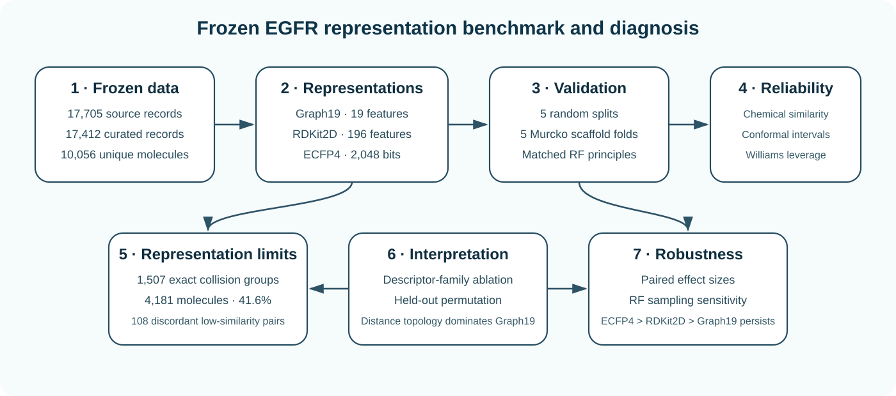

<p align="center">
  
</p>

<h1 align="center">EGFR Graph QSAR Reproducibility</h1>

<p align="center">
  <strong>Reproducibility repository for</strong><br/>
  <strong>Representation Degeneracy and Generalization Limits of Classical Molecular Graph Descriptors in EGFR QSAR</strong>
</p>

<p align="center">
  <a href="docs/FROZEN_RESULTS.md"></a>
  <a href="environment.yml"></a>
  <a href="docs/DATA_PROVENANCE.md"></a>
  <a href="CITATION.cff"></a>
  <a href="LICENSE"></a>
  
</p>

<p align="center">
  <a href="#why-this-study">Why this study?</a> •
  <a href="#method-at-a-glance">Method</a> •
  <a href="#key-results">Key results</a> •
  <a href="#representation-degeneracy">Degeneracy</a> •
  <a href="#reproducibility">Reproducibility</a> •
  <a href="#result-to-source-map">Result map</a> •
  <a href="#citation">Citation</a>
</p>

---

## Why this study?

Classical molecular graph invariants are compact, mathematically interpretable summaries of molecular topology. Their compactness is attractive, but extreme compression can also erase chemically important distinctions.

This study treats **19 classical graph invariants (Graph19)** as an intentionally compressed representation and asks how much EGFR pIC50 predictive signal remains accessible compared with contemporary molecular descriptors and fingerprints.

> **Central question:** What EGFR pIC50 predictive signal survives compression to 19 classical graph invariants, and where does that compression fail under scaffold and chemical-space shift?

The study is deliberately not framed as “Graph19 versus everything else for maximum accuracy.” It quantifies a **compactness–accuracy–generalization trade-off** and then diagnoses one concrete source of information loss: exact descriptor-vector degeneracy.

## Method at a glance

<p align="center">
  
</p>

The same frozen **10,056-compound EGFR cohort** is represented as Graph19, 196 retained RDKit2D descriptors, and 2,048-bit ECFP4 fingerprints. Representations are compared under matched Random Forest principles using five random splits and five Bemis-Murcko scaffold folds. Reliability is examined with nearest-training chemical similarity, Williams leverage, and split-conformal prediction intervals.

See [`docs/EXPERIMENT_PROTOCOL.md`](docs/EXPERIMENT_PROTOCOL.md) for the frozen protocol.

## Study design

| Component | Frozen design |
|---|---|
| Target | Human EGFR (`CHEMBL203`) |
| Endpoint | IC50 / pIC50 inhibitory potency |
| Source records | 17,705 |
| Curated activity rows | 17,412 |
| Final unique compounds | 10,056 |
| Graph representation | Graph19 — 19 classical invariants |
| Contemporary baselines | RDKit2D — 196; ECFP4 — 2,048 bits |
| Random validation | 5 fixed seeds |
| Scaffold validation | 5 Murcko GroupKFold partitions |
| Reliability | chemical similarity, leverage, conformal intervals |
| Strengthening analyses | exact collisions, paired effects, RF sampling sensitivity |

## Key results

| Evidence | Graph19 | RDKit2D | ECFP4 |
|---|---:|---:|---:|
| **Feature dimension** | **19** | 196 | 2,048 |
| **Random-split R²** | 0.392 ± 0.038 | 0.657 ± 0.017 | **0.735 ± 0.014** |
| **Scaffold R²** | 0.211 ± 0.136 | 0.518 ± 0.100 | **0.615 ± 0.062** |
| **Random RMSE** | 1.068 | 0.802 | **0.705** |
| **Scaffold RMSE** | 1.197 | 0.933 | **0.837** |

Matched ECFP4 gains over Graph19 were **+0.343 R²** (95% CI 0.309–0.377) under random splitting and **+0.404 R²** (95% CI 0.310–0.498) under scaffold splitting, with the same direction in all five matched partitions.

The interpretation is intentionally asymmetric: **Graph19 retains measurable predictive signal with extreme dimensional compression, but contemporary representations recover substantially more predictive and extrapolative information.**

## Representation degeneracy

Exact Graph19 descriptor vectors were grouped across the frozen cohort.

- **10,056 molecules → 7,382 unique Graph19 vectors**.
- **1,507 exact collision groups** contain **4,181 molecules (41.6%)**.
- **1,285 groups (85.3%)** contain more than one molecular formula.
- **117 groups** span more than **2 pIC50 units**.
- **108 molecular pairs** have identical Graph19 vectors, ECFP4 Tanimoto < 0.5, and |ΔpIC50| > 2.

These are **descriptor-vector collisions**, not claims that the underlying molecular graphs are isomorphic. They provide a direct, chemically interpretable explanation for part of the performance ceiling imposed by the compressed Graph19 encoding.

Detailed frozen statistics are in [`docs/FROZEN_RESULTS.md`](docs/FROZEN_RESULTS.md).

## Robustness to Random Forest feature sampling

The principal benchmark uses the frozen matched RF configuration. A reviewer-oriented sensitivity analysis replaced dimensionality-dependent `sqrt(p)` feature sampling with a common **50% feature fraction** across all representations.

| Representation | Random R² | Scaffold R² |
|---|---:|---:|
| Graph19 | 0.393 | 0.214 |
| RDKit2D | 0.670 | 0.530 |
| ECFP4 | **0.734** | **0.610** |

The ordering **ECFP4 > RDKit2D > Graph19** persisted, and selected full-feature spot checks preserved the same ordering.

## Frozen data lineage and provenance

Raw-source lineage is preserved rather than reconstructed from a newer ChEMBL release:

```text
17,705 archived EGFR IC50 records
        ↓
17,412 curated binding-assay activity rows
        ↓
10,056 unique compounds
(InChIKey grouping; median pIC50)
```

Of the 17,412 curated labels, **17,156** use ChEMBL `pchembl_value`; **256** use a compatible unit-derived fallback. All 19 Graph19 descriptors were independently regenerated and matched the archived descriptor matrix to approximately `5e-8`. The frozen cohort contains **3,579 unique Bemis-Murcko scaffolds**.

The original ChEMBL release identifier was not retained in the historical archive. This is disclosed rather than guessed. See [`docs/DATA_PROVENANCE.md`](docs/DATA_PROVENANCE.md), [`INPUT_MANIFEST.json`](INPUT_MANIFEST.json), and [`DATA_LICENSE_NOTICE.md`](DATA_LICENSE_NOTICE.md).

## Reproducibility

This repository is designed as an **auditable frozen-result package**, not a loose code dump.

It contains or maps to:

1. data-lineage and provenance records;
2. deterministic descriptor/fingerprint generation;
3. fixed random and scaffold validation logic;
4. historical-assurance and matched representation benchmarks;
5. Y-randomization, ablation and permutation analyses;
6. chemical-space, leverage and uncertainty diagnostics;
7. exact Graph19 representation-degeneracy analysis;
8. paired effect sizes and RF-sampling sensitivity;
9. machine-readable frozen result tables;
10. repository QA and environment specifications.

### Environment

```bash
conda env create -f environment.yml
conda activate paper003-egfr-qsar
```

or install the pip dependencies from [`requirements.txt`](requirements.txt).

### Lightweight repository QA

The GitHub Actions workflow in `.github/workflows/qa.yml` checks the public package. Full scientific retraining is intentionally not executed on every push.

See [`docs/REPRODUCIBILITY.md`](docs/REPRODUCIBILITY.md) for the exact reproducibility boundary.

## Result-to-source map

| Manuscript evidence | Machine-readable repository source |
|---|---|
| Representation benchmark | [`results/frozen/representation_benchmark_summary.csv`](results/frozen/representation_benchmark_summary.csv) |
| Descriptor-family ablation | [`results/frozen/descriptor_family_ablation_summary.csv`](results/frozen/descriptor_family_ablation_summary.csv) |
| Chemical-space shift | [`results/frozen/chemical_space_similarity_bins.csv`](results/frozen/chemical_space_similarity_bins.csv) |
| Conformal uncertainty | [`results/frozen/conformal_metrics.csv`](results/frozen/conformal_metrics.csv) |
| Paired representation effects | [`results/v31/paired_representation_effect_sizes.csv`](results/v31/paired_representation_effect_sizes.csv) |
| Graph19 ambiguity summary | [`results/v31/graph19_ambiguity_summary.json`](results/v31/graph19_ambiguity_summary.json) |
| Representative collision pairs | [`results/v31/representative_collision_pairs.csv`](results/v31/representative_collision_pairs.csv) |
| RF feature-sampling sensitivity | [`results/v31/rf_sensitivity_summary.csv`](results/v31/rf_sensitivity_summary.csv) |

## Repository structure

```text
.
├── .github/workflows/            # lightweight QA
├── data/                         # source notes / optional frozen data payload
├── docs/
│   ├── assets/                   # README visuals
│   ├── DATA_PROVENANCE.md
│   ├── EXPERIMENT_PROTOCOL.md
│   ├── FROZEN_RESULTS.md
│   ├── LICENSE_AND_USAGE.md
│   └── REPRODUCIBILITY.md
├── results/
│   ├── frozen/                   # V3 submission-aligned summaries
│   └── v31/                      # representation-degeneracy + robustness outputs
├── scripts/                      # reproducibility pipeline
├── v31/                          # V3.1 strengthening workflow
├── CITATION.cff
├── environment.yml
├── requirements.txt
└── README.md
```

## Scientific scope and limitations

This is an **EGFR-specific representation study**, not evidence that Graph19, RDKit2D, or ECFP4 universally dominates for all targets or learners.

Important boundaries include:

- pIC50 is an inhibitory-potency endpoint, not a thermodynamic binding-affinity constant;
- Graph19 intentionally omits atom labels, bond orders, stereochemical detail, 3D geometry, protein state and assay context;
- descriptor-vector collisions do not imply molecular-graph isomorphism;
- the representation comparison is model-mediated rather than an information-theoretic proof;
- scaffold conformal coverage is an empirical distribution-shift stress test, not a formal exchangeability-guaranteed coverage result;
- the historical ChEMBL release identifier was not preserved;
- conclusions are target- and protocol-specific.

## Release status

**Current status: manuscript submission repository.**  
GitHub is the public reproducibility source for initial journal submission. An immutable archival DOI can be added later if required by the editor, during revision, or after acceptance; it is not treated here as a prerequisite for the initial submission.

## Authors

- **Sunilgar L. Gusai** — corresponding author, Marwadi University  
  ORCID: [0009-0004-0739-4812](https://orcid.org/0009-0004-0739-4812)
- **Manoharsinh R. Jadeja** — Marwadi University

## Citation

Citation metadata are provided in [`CITATION.cff`](CITATION.cff). Publication DOI/journal metadata will be added when available.

## License and usage

Original project code is released under the **MIT License**. ChEMBL-derived material remains subject to its source terms and attribution requirements. See [`docs/LICENSE_AND_USAGE.md`](docs/LICENSE_AND_USAGE.md) and [`DATA_LICENSE_NOTICE.md`](DATA_LICENSE_NOTICE.md).
